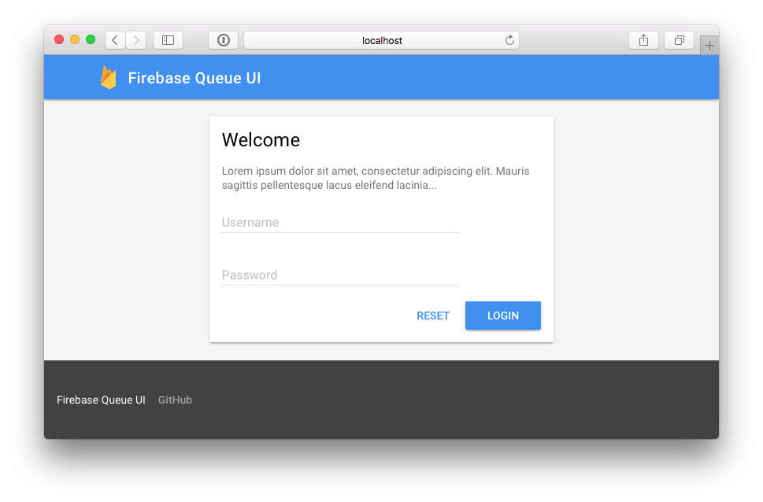

[](https://circleci.com/gh/isapp/firebase-queue-ui)

# Firebase Queue UI



### Setup

Notice that each step is **required**.

Run the commands below to clone and install dependencies

```bash
git clone git@github.com:isapp/firebase-queue-ui.git && cd firebase-queue-ui
```

```bash
npm install
```

Create an env file and fill it with your credentials

```bash
touch .env
```

*.env*
```
API_KEY=
AUTH_DOMAIN=
DATABASE_URL=
STORAGE_BUCKET=
MESSAGING_SENDER_ID=
```

In order to fill your side menu with queues, create a `queue.json` file in `app/`:

```bash
touch app/queue.json
```

*app/queue.json*
```
{
  "device": {
    "name": "Device",
    "path": "/queue/v1/device/tasks"
  },
  "friendship": {
    "name": "Friendship",
    "path": "/queue/v1/friendship/tasks"
  },
  "location": {
    "name": "Location",
    "path": "/queue/v1/location/tasks"
  },
  "message": {
    "name": "Message",
    "path": "/queue/v1/message/tasks"
  },
  "user": {
    "name": "User",
    "path": "/queue/v1/user/tasks"
  }
}
```

### Preview

Run to preview and watch for changes

```bash
gulp serve
```

### Build

Run to build for production

```bash
gulp
```

### Tests

Run to execute tests

```bash
gulp test
```

## License

[MIT](LICENSE)
